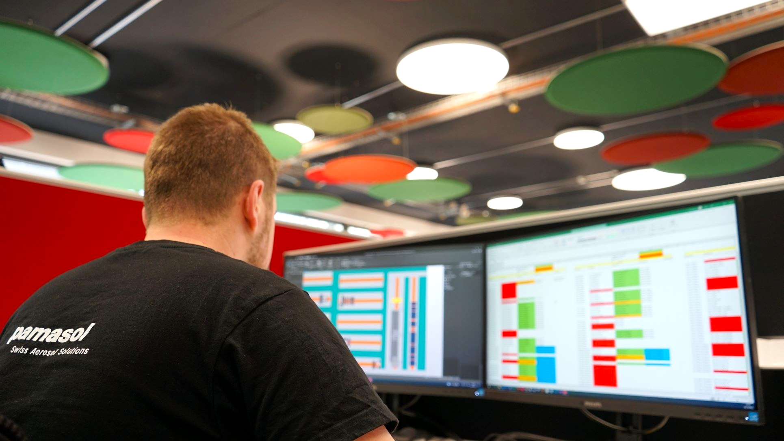

+++
title = "Home"
+++

# Pamasol Electrics Portal

{}
This website is maintained by employees and trainees at Pamasol Willi Mäder AG who are addicted to automation and technology. The published projects are addressed to electrical engineers, PLC software developer and young people with an interest in the profession [automation engineer](https://www.swissmechanic.ch/grundbildung-erwachsenenbildung/deine-lehre-grundbildung/artmid/786/articleid/105/automatikerin-ef). The official website of Pamasol can be reached at [www.pamasol.com](https://www.pamasol.com).
{}

## Changelog

* **17-Feb-22:** Support section extended with image of EWON Cosy 131
* **15-Feb-22:** Support section added
