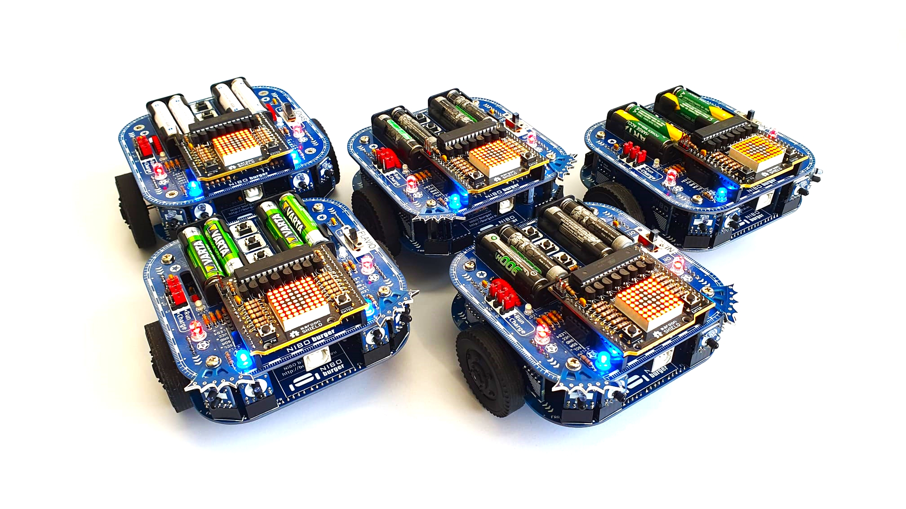
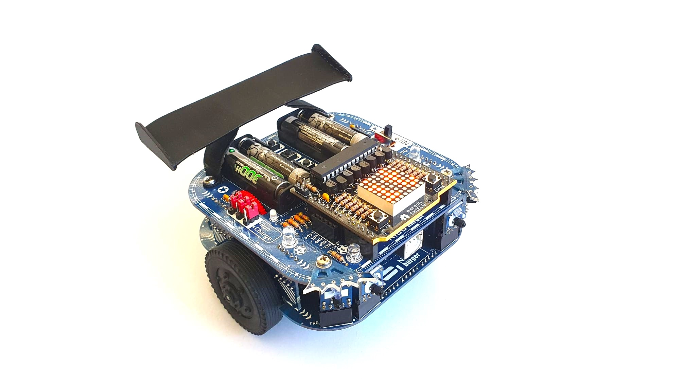

+++
chapter = false
title = "Electronics project"
weight = 2
+++

## Programming robots for automation engineer apprentices

In combination with professional school, inter-company professional trainings at [Swissmechanic](https://www.swissmechanic.ch/) and practical jobs at aerosol machines for customers around the world, **automation engineer apprentices** at Pamasol also work on projects which focus on a certain topic.

NIBO Burger represents the **electronics project** of the apprenticeship. It consists of a small robot which will be assembled, **soldered** and programmed in the [standard language C](https://en.wikipedia.org/wiki/C_(programming_language)) by the apprentices.

The scope, including any and all datasheets and Wiki articles, are written in english. After the assembly and functionality test the apprentices will get an introduction in **programming with C**. The highlight of the project consists of the following «master tasks».

As a bonus excercise the  robot will get visual upgrades made with **3D printed parts**. See below a [rear spoiler](https://a360.co/3FAwiLr) as an example.

### A) Round trip
The robot has to drive exactly 1.5m forward, turn 180° and return to his home position. To make this excercise work, the [odometry sensors](https://en.wikipedia.org/wiki/Odometry) of the wheels need to be read out and compared. Based on this the [PID controlled](https://en.wikipedia.org/wiki/PID_controller) motors turn accordingly.

[Excercise round trip (Nibo01_V1.0.pdf)](https://github.com/pamasol/Lehrlingsprojekt-Nibo-Burger/files/3652583/Nibo01_V1.0.pdf)

### B) Fraidy cat
The front of the robot has built-in IR bricks. These are infrared sensors which can detect obstacles. In this excercise, the robot has to avoid these obstacles.

[Excercise fraidy cat (Nibo02_V1.0.pdf)](https://github.com/pamasol/Lehrlingsprojekt-Nibo-Burger/files/3652584/Nibo02_V1.0.pdf)

### C) Follow me
Contrary to excercise B, in excercise C the robot doesn't have to avoid obstacles but instead follow them. In this case the human hand.

[Excercise follow me (Nibo03_V1.0.pdf)](https://github.com/pamasol/Lehrlingsprojekt-Nibo-Burger/files/3652585/Nibo03_V1.0.pdf)

### D) Colour detection
With the [RGB](https://en.wikipedia.org/wiki/RGB_color_spaces) (red-green-blue) coloursensors the basic colours black, white, red, yellow, green and blue have to be detected and displayed on the built-in display. The display runs independently with a separate [microcontroller](https://en.wikipedia.org/wiki/Microcontroller). The microcontroller of the robot communicates with the microcontroller of the display by [UART](https://en.wikipedia.org/wiki/Universal_asynchronous_receiver-transmitter).

[Excercise colour detection (Nibo04_V1.1.pdf)](https://github.com/pamasol/Lehrlingsprojekt-Nibo-Burger/files/8169805/Nibo04_V1.1.pdf)

### E) Rabbit warren
In the supreme discipline the robot has to follow a black line on the ground. The line gets detected with sensors which in turn control the motors.

[Excercise rabbit warren (Nibo05_V1.0.pdf)](https://github.com/pamasol/Lehrlingsprojekt-Nibo-Burger/files/3652587/Nibo05_V1.0.pdf)

## Documentation

The elctrical parts, in combination with the soldered circuits and the program, get summraized in a written documentation by the apprentices. The following PDFs can be downloaded for a later reading.

| Name             | Date      | Profession          | Documentation   |
| ---------------- | --------- | --------------------| --------------- |
| Marvin Büeler    | 2016-2020 | automation engineer | [Download PDF](./docs/2019-12-16_Nibo_Doku_MarvinBueeler.en.pdf)
| Joel Glaus       | 2017-2021 | automation engineer | [Download PDF](./docs/2020-04-28_Nibo_Doku_JoelGlaus.en.pdf)
| David Bernhard   | 2018-2022 | automation engineer | [Download PDF](./docs/2020-04-28_Nibo_Doku_DavidBernhard.en.pdf)
| Jonas Bisig      | 2018-2022 | automation engineer | [Download PDF](./docs/2022-03-04_Nibo_Doku_JonasBisig.en.pdf)
| Stefan Feier     | 2019-2023 | automation engineer | [Download PDF](./docs/2022-05-12_Nibo_Doku_StefanFeier.en.pdf)
| Nicolas Diethelm | 2020-2024 | automation engineer | [Download PDF](./docs/2022-06-02_Nibo_Doku_NicolasDiethelm.en.pdf)
| Flavio Knobel    | 2020-2024 | automation engineer | [Download PDF](./docs/2022-05-23_Nibo_Doku_FlavioKnobel.en.pdf)
| Kevin Kälin      | 2021-2025 | automation engineer |
| Linus Lacher     | 2022-2026 | automation engineer |

{}
The project description in english including the excercises and support are available in the following GitHub repository: https://github.com/pamasol/Lehrlingsprojekt-Nibo-Burger
{}
