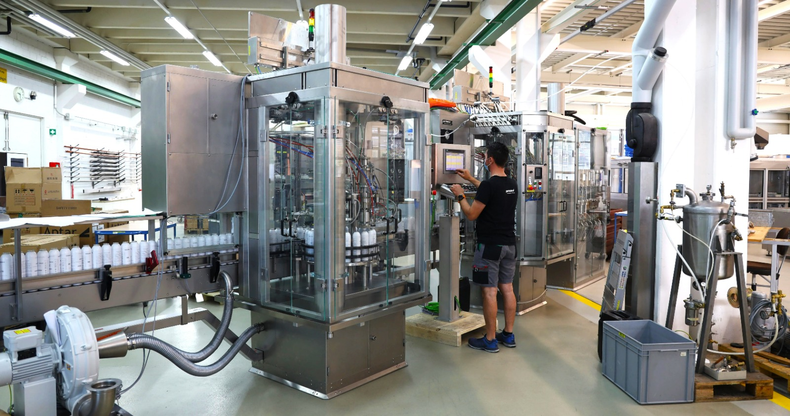

+++
chapter = false
title = "Schnupperlehre"
weight = 1
+++

## Die weltbesten Anlagen für Spraydosen

Interessiert dich der Beruf des **Automatikers**? Dann nichts wie los, melde dich zur Schnupperlehre an und du erhältst einen Einblick in die spannende Welt des Maschinenbaus – angefangen von der **mechanischen Bearbeitung** und Montage, über die **Verdrahtung** von Elektrokomponenten bis hin zur **Pneumatiksteuerung** und **Softwareentwicklung**.

Im obigen Bild testet ein Pamasol-Mitarbeiter einen **Macromat LB20**. Das ist eine Abfüll- und Verschliessmaschine für Spraydosen. Während sich Polymechaniker und Metallbauer um Mechanik und Metallteile kümmern, baut der **Automatiker** alle elektrischen Komponenten wie **Sensoren, Motoren** und den grossen **Touch-Screen** an. Im Anschluss wird die **SPS** (das ist der Computer und somit das Hirn der Anlage) **programmiert** und damit der Maschine Leben eingehaucht.

Sobald die Anlage funktioniert und vom Kunden abgenommen wurde, wird sie in an den Produktionsstandort versendet. Das kann beispielsweise Australien, die USA oder Brasilien sein, aber auch Deutschland und die Schweiz. Es gibt Pamasol Anlagen auf **der ganzen Welt**, welche Milliarden von Spraydosen produzieren.

Ausgelernte Automatiker haben bei Pamasol die Möglichkeit, andere **Länder und Kulturen** kennenzulernen. Denn die Anlagen, welche über die ganze Welt verteilt sind, werden durch Pamasol-Mitarbeiter vor Ort in Betrieb genommen und gewartet.

Aufgefallen ist es dir wahrscheinlich nicht, aber du hattest bestimmt schon eine Spraydose in der Hand, welche auf einer Pamasol Anlage gefüllt wurde (Deo, Farbspray, Backofenreiniger, Rasierschaum, Silikonspray, Öl-Spray, und so weiter).

Folgend einige Antworten zu Fragen, welche uns oft gestellt werden.

### Sind Automatiker gefragte Berufsleute?

Ja, Automatiker sind sehr **begehrte Berufsleute** und sie werden es auch in Zukunft sein.

Immer mehr Aufgaben und Arbeiten werden von Maschinen und Robotern übernommen. Damit das möglich ist, braucht es Automatiker. Sie bauen diese Maschinen und schreiben die zugehörige Software.

### Wie lange dauert die Lehre und wo geht man zur Berufsschule?

Die Lehre dauert **4 Jahre**. Während dieser Zeit besuchen die lernenden Automatiker bei Pamasol an einem bis zwei Tagen pro Woche die [Berufsschule](https://www.bbzg.ch/) **in Goldau**. Macht man die Berufsmatura während der Lehre, hat man in allen vier Lehrjahren zwei Tage Schule.

Zusätzlich zur Berufsschule besucht man die überbetriebliche Kurse im Ausbildungszentrum der [Swissmechanic](https://sz.swissmechanic.ch/ausbildungszentrum) in Pfäffikon. Diese Kurse dauern jeweils einige Wochen.

### Welche Weiterbildungsmöglichkeiten gibt es?

Es gibt enorm viele Weiterbildungsmöglichkeiten wie beispielsweise die Berufsprüfung zum **Automatikfachmann** oder die Höhere Fachprüfung zum **Meister Schaltanlagen und Automatik**. Die mit Abstand beliebtesten Weiterbildungen von Pamasol Automatikern waren bisher jedoch die Ausbildungen zum **Techniker** (HF - Höhere Fachschule ) oder zum **Ingenieur** (FH - Fachhochschule).

Hat man die Berufsmatura gemacht, kann man sich beispielsweise an der [ost.ch]( https://www.ost.ch/de/) zum Ingenieur weiterbilden.

### Was verdient man als Automatiker?

Pauschal kann man das nicht beantworten. Enorm viele Faktoren wie Ausbildung, Funktion und Position eines Mitarbeiters oder der Standort und die Branche des Unternehmens spielen eine Rolle.

Was man aber sagen kann. Macht jemand seinen Job gerne und ist Feuer und Flamme für seinen Beruf, wirkt sich das auch positiv aufs Gehalt aus.

Ok, die obigen Angaben helfen nicht wirklich weiter und wir möchten Interessierte nicht im Ungewissen stehen lassen. Folgende Zahlen sind vom Online Portal jobs.ch und können einen ungefähren Anhaltspunkt geben.

**Automatiker**
* [Jobs.ch für Automatiker](https://www.jobs.ch/de/lohn/?canton=ch&term=automatiker), abgerufen am 05.06.2022.
* CHF 65'027 Jahreslohn, was bei 12 Monaten einem Lohn von **CHF 5'418.90** entspricht pro Monat.

**Elektroingenieur**
* [Jobs.ch für Elektroingenieure](https://www.jobs.ch/de/lohn/?canton=ch&term=elektroingenieur), abgerufen am 05.06.2022.
* CHF 96'981 Jahreslohn, was bei 12 Monaten einem Lohn von **CHF 8'081.75** entspricht pro Monat.

### Video Automatiker EFZ

  

{}
Auf der [offiziellen Webseite von Pamasol](https://www.pamasol.com/de/wer-wir-sind#lehrstellen#panel2084) kannst du dich zu allen Lehrberufen informieren, welche angeboten werden.
{}

{}
Wende dich an Andreas Rüttimann [andreas.ruettimann@pamasol.com](andreas.ruettimann@pamasol.com) oder Telefon [+41 55 417 40 40](tel:+41554174040), um dich für eine Schnupperlehre als Automatiker anzumelden.
{}
