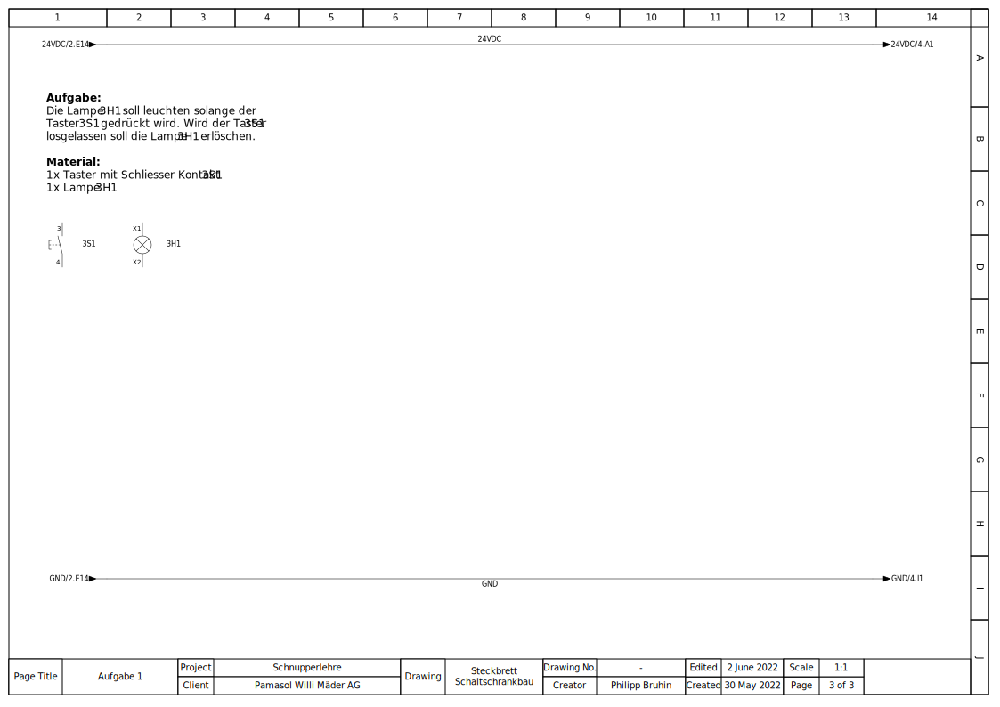

+++
chapter = false
title = "Schaltschrank Steckbrett"
weight = 2
+++

## Elektroschema zeichnen und verdrahten

Zu den wichtigsten Aufgaben des Automatikers zählt das **Planen** und **Verdrahten von Steuerschränken**. Diese Steuerschränke können mal die Grösse einer Schuhschachtel und mal die Grösse von vier aneinandergereihten, grossen Kleiderschränke haben.

Gefüllt sind die Schränke mit komplexer **Elektronik**, welche mittels **Litzen** (flexible Drähte) verbunden werden. Ist von den vielen hundert Litzen nur eine falsch angeschlossen, läuft die Anlage nicht. Im dümmsten Fall gehen sogar Bauteile kaputt, welche so teuer sind wie ein Auto.

Beim Zeichnend des Schemas sowie beim Verdrahten ist somit höchste Konzentration und Vorsicht geboten. Allem voran kommt jedoch das Üben – und genau das wird bei dieser Aufgabe gemacht.

### Elektroschema Zeichnen via Electra Cloud

Im professionellen Umfeld werden Elektroschemas auf Programmen wie [EPLAN P8](https://www.eplan.com/), [Zucken E3](https://www.zuken.com/) oder [WS-Cad](https://www.wscad.com/) gezeichnet.

Für das folgende Projekt empfehlen wir jedoch das einfach zu bedienende CAD [Electra Cloud von Radica Software](https://radicasoftware.com/). Die Grundfunktionen, welche **kostenlos** genutzt werden können, sind völlig ausreichend für die beschriebenen Aufgaben. Zudem muss die Software nicht installiert werden. Sie läuft im **Internet-Browser**.

Auf [radicasoftware.com/app/login](https://radicasoftware.com/app/login.php) kann man sich registrieren, um Zugriff auf den Schema-Editor zu erhalten.

### Normen für das Zeichnen

https://de.wikipedia.org/wiki/Schaltzeichen

* [Allgemeine Schaltzeichen](https://de.wikipedia.org/wiki/Liste_der_Schaltzeichen)
* [Elektrik/Elektronik](https://de.wikipedia.org/wiki/Liste_der_Schaltzeichen_(Elektrik/Elektronik))
* [Mess-, Steuer- und Regelungstechnik](https://de.wikipedia.org/wiki/Liste_der_Schaltzeichen_(Mess-,_Steuer-_und_Regelungstechnik))

### Vorlage Aufgabe 1

TODO: Erklärung Aufgabe

### Beispiellösung Aufgabe 1

TODO: Erklärung Schema

{}
Das Elektroschema mit den Aufgaben kann [hier](https://radicasoftware.com/app/publish/-N3K8EXFBIiQDAMhzdRG/Steckbrett_Schaltschrankbau) als Vorlage importiert werden. Wer das Schema nicht online mit [Electra Cloud](https://radicasoftware.com/) zeichnen möchte, kann es [hier als PDF](./docs/Steckbrett_Schaltschrankbau.de.pdf) herunterladen.
{}
