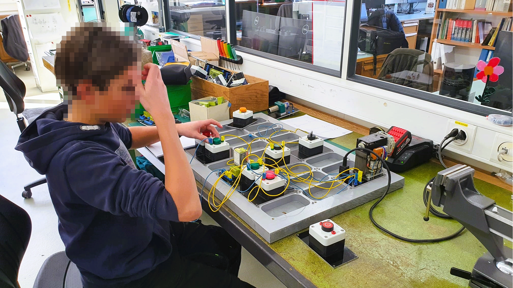

+++
chapter = false
title = "Schaltschrank Steckbrett"
weight = 2
+++

## Elektroschema zeichnen und verdrahten

TODO: Allgemeine Info

* Schema zeichnen und verdrahten sind wichtige Aufgaben von Automatiker
* Jede Steuerung hat Elektroschema
* Logisches Denken

### Vorlage Aufgabe 1

TODO: Erklärung Aufgabe

### Beispiellösung Aufgabe 1

TODO: Erklärung Schema

{}
Das Elektroschema mit den Aufgaben kann [hier](https://radicasoftware.com/app/publish/-N3K8EXFBIiQDAMhzdRG/Steckbrett_Schaltschrankbau) als Vorlage importiert werden. Wer das Schema nicht online mit [Electra Cloud](https://radicasoftware.com/) zeichnen möchte, kann es [hier als PDF](./docs/Steckbrett_Schaltschrankbau.de.pdf) herunterladen.
{}
